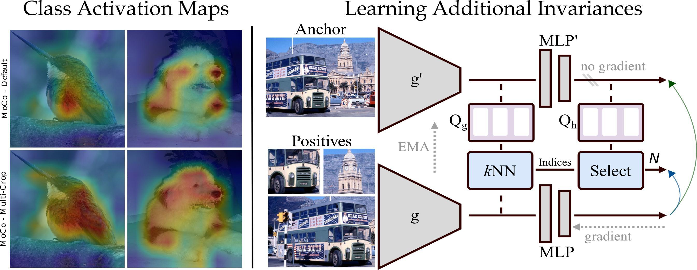
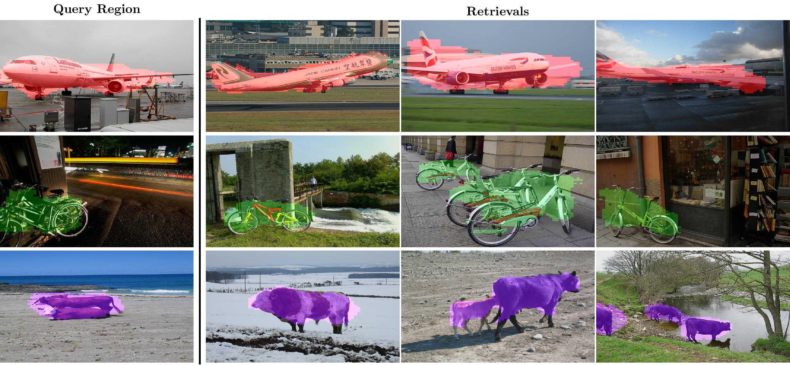
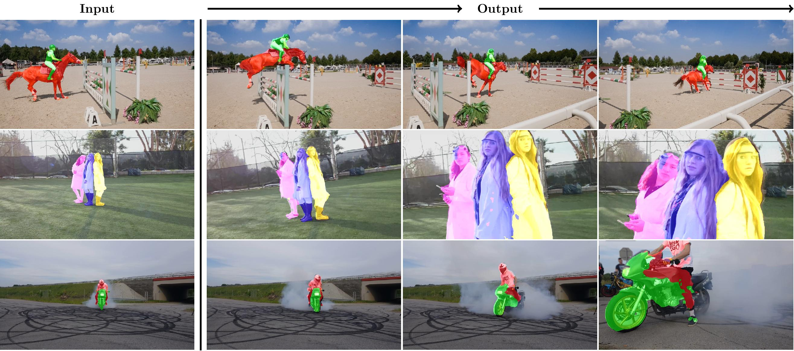

# Revisiting Contrastive Methods for Unsupervised Learning of Visual Representations

This repo contains the Pytorch implementation of our paper:
> [**Revisiting Contrastive Methods for UnsupervisedLearning of Visual Representations**](https://arxiv.org/abs/2106.05967)
>
> [Wouter Van Gansbeke](https://twitter.com/WGansbeke), [Simon Vandenhende](https://twitter.com/svandenh1), [Stamatios Georgoulis](https://twitter.com/stam_g) and [Luc Van Gool](https://scholar.google.com/citations?user=TwMib_QAAAAJ&hl=en).

<p align="left">
    

## Contents
1. [Introduction](#introduction)
0. [Key Results](#key-results)
0. [Installation](#installation)
0. [Training](#training)
0. [Evaluation](#evaluation)
    - [Linear Classifier](#linear-classifier)
    - [Semantic Segmentation](#semantic-segmentation)
    - [Segment Retrieval](#segment-retrieval)
    - [Video Instance Segmentation](#video-instance-segmentation)
0. [Model Zoo](#model-zoo)
0. [Citation](#citation)

## Introduction
Contrastive self-supervised learning has outperformed supervised pretraining on many downstream tasks like segmentation and object detection. However, current methods are still primarily applied to curated datasets like ImageNet. We first study how biases in the dataset affect existing methods. Our results show that an approach like MoCo works surprisingly well across: (i) object- versus scene-centric, (ii) uniform versus long-tailed and (iii) general versus domain-specific datasets. Second, given the generality of the approach, we try to realize further gains. We show that learning additional invariances - through the use of multi-scale cropping, stronger augmentations and nearest neighbors - improves the representations. Finally, we observe that MoCo learns spatially structured representations when trained with a multi-crop strategy. The representations can be used for semantic segment retrieval and video instance segmentation without finetuning. Moreover, the results are on par with specialized models. We hope this work will serve as a useful study for other researchers.
    
## Key Results
- __Scene-centric Data__: We do not observe any indications that contrastive pretraining suffers from using scene-centric image data. This is in contrast to prior belief. Moreover, if the downstream data is non-object-centric, pretraining on scene-centric datasets even outperforms ImageNet pretraining. 
- __Dense Representations__: The multi-scale cropping strategy allows the model to learn spatially structured representations. This questions a recent trend that proposed additional losses at a denser level in the image. The representations can be used for semantic segment retrieval and video
instance segmentation without any finetuning.
- __Additional Invariances__: We impose additional invariances by exploring different data augmentations and nearest neighbors to boost the performance.
- __Transfer Performance__: We observed that if a model obtains improvements for the downstream classification tasks, the same improvements are not guaranteed for other tasks (e.g. semantic segmentation) and vice versa. 
  
## Installation
The Python code runs with recent Pytorch versions, e.g. 1.6. 
Assuming [Anaconda](https://docs.anaconda.com/anaconda/install/), the most important packages can be installed as:
```shell
conda install pytorch=1.6.0 torchvision=0.7.0 cudatoolkit=10.2 -c pytorch
conda install -c conda-forge opencv           # For evaluation
conda install matplotlib scipy scikit-learn   # For evaluation
```
We refer to the `environment.yml` file for an overview of the packages we used to reproduce our results.
The code was run on 2 Tesla V100 GPUs. 

## Training
Now, we will pretrain on the COCO dataset. You can download the dataset from the [official website](https://cocodataset.org/#home). Several scripts in the `scripts/` directory are provided. It contains the vanilla MoCo setup and our additional modifications for both 200 epochs and 800 epochs of training. First, modify `--output_dir` and the dataset location in each script before executing them. Then, run the following command to start the training for 200 epochs:
```shell
sh scripts/ours_coco_200ep.sh # Train our model for 200 epochs.
```

The training currently supports:
- [x] MoCo
- [x] + Multi-scale constrained cropping
- [x] + AutoAugment
- [x] + kNN-loss

A detailed version of the pseudocode can be found in Appendix B.

## Evaluation
We perform the evaluation for the following downstream tasks: linear classification (VOC), semantic segmentation (VOC and Cityscapes), semantic segment retrieval and video instance segmentation (DAVIS). More details and results can be found in the main paper and the appendix.

### Linear Classifier
The representations can be evaluated under the linear evaluation protocol on PASCAL VOC. Please visit the `./evaluation/voc_svm` directory for more information.
    
### Semantic Segmentation
We provide code to evaluate the representations for the semantic segmentation task on the PASCAL VOC and Cityscapes datasets. Please visit the `./evaluation/segmentation` directory for more information.

### Segment Retrieval
<p align="left">
    
    
In order to obtain the results from the paper, run the publicly available [code](https://github.com/wvangansbeke/Unsupervised-Semantic-Segmentation) with our weights as the initialization of the model. You only need to adapt the amount of clusters, e.g. 5.
    
### Video Instance Segmentation
<p align="left">
    
    
In order to obtain the results from the paper, run the publicly available [code](https://github.com/ajabri/videowalk) from Jabri et al. with our weights as the initialization of the model.

## Model Zoo
Several pretrained models can be downloaded here. For a fair comparison, which takes the training duration into account, we refer to Figure 5 in the paper. More results can be found in Table 4 and Table 9.
| Method       | Epochs   | VOC SVM | VOC mIoU | Cityscapes mIoU | DAVIS J&F |Download link |
|--------------| ---------|---------|----------|-----------------|-----------|--------------|
| MoCo         |  200     |  76.1   |   66.2   |    70.3         |    -      |[Model](https://drive.google.com/file/d/1JcyLlsRzRPv2oAzeD9_Lj2ToT2LxwpxF/view?usp=sharing) 🔗 | 
| Ours         |  200     |  85.1   |   71.9   |    72.2         |    -      |[Model](https://drive.google.com/file/d/1A6TWp5JpquJtlm9oG0ly1-JSiSnqh2Tl/view?usp=sharing) 🔗 |
| MoCo         |  800     |  81.0   |   71.1   |    71.3         |    63.2   |[Model](https://drive.google.com/file/d/12vo1CbXwt1juKVxBJ6FInjwRADELdO_f/view?usp=sharing) 🔗 |
| Ours         |  800     |  85.9   |   73.5   |    72.3         |    66.2   |[Model](https://drive.google.com/file/d/1sxlSV2Qs1j-Ey4HLsCM8PsD0W9lHJZf6/view?usp=sharing) 🔗 |

    
## Citation
This code is based on the [MoCo](https://github.com/facebookresearch/moco) repository.
If you find this repository useful for your research, please consider citing the following paper(s):

```bibtex
@article{vangansbeke2021revisiting,
  title={Revisiting Contrastive Methods for Unsupervised Learning of Visual Representations},
  author={Van Gansbeke, Wouter and Vandenhende, Simon and Georgoulis, Stamatios and Van Gool, Luc},
  journal={arxiv preprint arxiv:2106.05967},
  year={2021}
}
@inproceedings{he2019moco,
  title={Momentum Contrast for Unsupervised Visual Representation Learning},
  author={Kaiming He and Haoqi Fan and Yuxin Wu and Saining Xie and Ross Girshick},
  booktitle = {Conference on Computer Vision and Pattern Recognition},
  year={2019}
}
```
    
For any enquiries, please contact the main authors.

## Extra
- For an overview on self-supervised learning (SSL), have a look at the [overview repository](https://github.com/wvangansbeke/Self-Supervised-Learning-Overview).
- Interested in self-supervised semantic segmentation? Check out our recent work: [MaskContrast](https://github.com/wvangansbeke/Unsupervised-Semantic-Segmentation).
- Interested in self-supervised classification? Check out [SCAN](https://github.com/wvangansbeke/Unsupervised-Classification).
- Other great SSL repositories: [MoCo](https://github.com/facebookresearch/moco), [SupContrast](https://github.com/HobbitLong/SupContrast), [SeLa](https://github.com/yukimasano/self-label), [SwAV](https://github.com/facebookresearch/swav) and many more [here](https://github.com/wvangansbeke/Self-Supervised-Learning-Overview).

## License

This software is released under a creative commons license which allows for personal and research use only. You can view a license summary [here](http://creativecommons.org/licenses/by-nc/4.0/). Part of the code was based on [MoCo](https://github.com/facebookresearch/moco). Check it out for more details.

## Acknoledgements
This work was supported by Toyota, and was carried out at the TRACE Lab at KU Leuven (Toyota Research on Automated Cars in Europe - Leuven).
